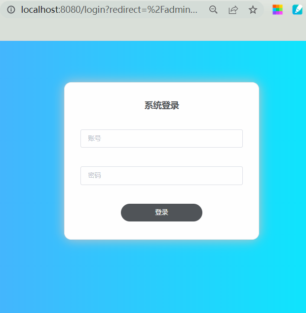

# lab2 实验报告

[toc]

### 一、小组分工

组长：吴小芥 

- 前端开发
    - 孙姝然：前后端接口调用、表单验证、前端路由拦截、动态页面、登录与注册表单页面
    - 张涵星：静态页面编写：用户登录页面、信息录入界面等

- 后端开发
    - 王耕宇：管理员录入信息功能，注册信息格式和唯一性检查功能，配合前端进行权限验证，session
    - 吴小芥：用户登录功能，密码重置功能，拦截器(登陆验证、register权限验证)，后端json封装

### 二、实验设计

#### 1、功能逻辑设计

后端信息录入功能：获取前端录入信息，对信息进行格式检查、唯一性检查，向前端发送检测结果。符合规范的数据添加至数据库。

前端：
- 表单验证：填写时做简单的格式判断，更加用户友好。提交时调用后端api，验证格式与唯一性。
- 拦截：每次跳转进行权限验证，无权限返回登录页面。
- 重置密码：初次登录后跳出密码修改界面，不成功重置（改变用户状态）无法离开该页面。
- 登录跳转：动态渲染的管理员/普通用户主页

#### 2、测试用例

##### 后端测试（使用postman）

###### 1.用户初次登录（使用初始密码，需要重置密码）

- 登录root账户 POST：
```json
{
    "visitor_id":"root",
    "role":"admin",
    "login_url":"127.0.0.1",
    "passwd":"123456"
}
```
反馈结果：因密码过于简单（初次登录）而要求修改密码，前台自动跳转到修改密码页面
```json
{
  "login_approved": true,
  "url_empty": true,
  "find_id": true,
  "passwd_correct": true,
  "repeat_login": true,
  "passwd_check": false
}
```
- 修改root密码 POST：
```json
{
  "visitor_id":"root",
  "old_passwd":"123456",
  "new_passwd":"Aa_123456"
}
```
反馈结果：密码更新成功，同时更新到数据库
```json
{
    "change_approved": true,
    "old_passwd_correct": true,
    "passwdFormat": {
        "legal": true,
        "too_short": false,
        "too_long": false,
        "too_simple": false,
        "illegal_char": false
    }
}
```
###### 2. 用户非初次登录（不再提示修改密码）

- 再次登陆 POST：

```json
{
    "visitor_id":"root",
    "role":"admin",
    "login_url":"127.0.0.1",
    "passwd":"Aa_123456"
}
```
反馈结果：登陆成功
```json
{
  "login_approved": true,
  "url_empty": true,
  "find_id": true,
  "passwd_correct": true,
  "repeat_login": true,
  "passwd_check": true
}
```
######3.管理员录入用户信息格式错误

- root添加新用户，不慎输错邮箱、id，遗漏身份证号码 POST：

```json
{
  "visitor_id":"root",
  "role":"student",
  "user_id":"22445678",
  "username":"jack",
  "phone_number":"12345678901",
  "email":"jack.163.com"
}
```
反馈结果：缺少身份证号码，id、邮箱格式错误，信息不符合要求：
```json
{
  "isOk": false,
  "role": true,
  "user_id": true,
  "username": true,
  "id_number": false,
  "phone_number": true,
  "email": true,
  "passwd": null,
  "registerFormat": {
    "isOk": false,
    "id_numberUnique": true,
    "id_numberFormat": true,
    "emailFormat": false,
    "phone_numberFormat": true,
    "usernameFormat": true,
    "roleFormat": true,
    "user_idUnique": true,
    "user_idFormat": false
  }
}
```
###### 4.管理员录入用户信息唯一性冲突

- root添加新用户，输入已存在用户id、用户身份证号 POST：

```json
{
  "visitor_id":"root",
  "role":"student",
  "user_id":"220001",
  "username":"jack",
  "id_number":"410526200003110000",
  "phone_number":"12345678901",
  "email":"jack@163.com"
}
```
反馈结果：用户id、身份证号冲突，信息不符合要求：
```json
{
  "isOk": false,
  "role": true,
  "user_id": true,
  "username": true,
  "id_number": true,
  "phone_number": true,
  "email": true,
  "passwd": "123456",
  "registerFormat": {
    "isOk": false,
    "id_numberUnique": false,
    "id_numberFormat": true,
    "emailFormat": true,
    "phone_numberFormat": true,
    "usernameFormat": true,
    "roleFormat": true,
    "user_idUnique": false,
    "user_idFormat": true
  }
}
```

###### 5.管理员正确录入用户信息

- 核对信息后root再次添加新用户 POST：

```json
{
  "visitor_id":"root",
  "role":"student",
  "user_id":"224456",
  "username":"jack",
  "id_number":"312220200102031023",
  "phone_number":"",
  "email":""
}
```
反馈结果：添加成功
```json
{
  "isOk": true,
  "role": true,
  "user_id": true,
  "username": true,
  "id_number": true,
  "phone_number": true,
  "email": true,
  "passwd": "123456",
  "registerFormat": {
    "isOk": true,
    "id_numberUnique": true,
    "id_numberFormat": true,
    "emailFormat": true,
    "phone_numberFormat": true,
    "usernameFormat": true,
    "roleFormat": true,
    "user_idUnique": true,
    "user_idFormat": true
  }
}
```
数据库最终状态：  
```json
{
  "RECORDS": [
  	{
  	"user_id":"220001",
  	"role":"student",
  	"username":"jack",
  	"id_number":"410526200003110000",
  	"phone_number":NULL,
	"email":NULL,
	"login_status": "0",
    "last_login_url": "",
    "session_id": ""
  	},
    {
      "user_id": "224456",
      "role": "student",
      "username": "jack",
      "id_number": "312220200102031023",
      "phone_number": "12345678901",
      "email": "jack@163.com",
      "passwd": "123456",
      "register_year": "2022",
      "login_status": "0",
      "last_login_url": "",
      "session_id": ""
    },
    {
      "user_id": "root",
      "role": "admin",
      "username": "root",
      "id_number": "310110200204081015",
      "phone_number": "12345678901",
      "email": "wuxiaojieone@163.com",
      "passwd": "Aa_123456",
      "register_year": "2020",
      "login_status": "1",
      "last_login_url": "127.0.0.1",
      "session_id": "28A92DDD3172EE56251A402F06CA756D"
    }
  ]
}
```
##### 前端测试（使用页面）

###### 1.用户初次登录

- 登录用户"jack"，输入id：224456与初始密码：123456，自动跳转到密码修改页面。
  

###### 2.重置密码

- 重置密码为：Aa_123456，分别试错：①输错原密码、①两次密码不一致、③输入纯数字密码，得到提示“旧密码错误”、“两次输入密码不一致”、“字母，数字或者特殊字符（-_）至少包含两种”，最后正确输入，重置成功。
  

###### 3.用户登录失败

- 登录root用户，分别故意输错账号和密码，得到提示“学号/工号填写错误”、“密码错误”，最后正确输入，登陆成功。
  

###### 4.添加用户信息格式错误

- 在root用户中，点击“管理-添加学生/教师”，输入如下的教师信息，故意输错手机格式、身份证号、id位数，得到提示：“请输入合法手机号”、“身份证格式有误”、“教师工号为8位数字”，之后进行更正，提示“注册成功”。
  

###### 5.添加用户信息唯一性冲突

- 在root用户中，点击“管理-添加学生/教师”，输入如下的教师信息，故意冲突的学号/工号、身份证号，得到提示：“学号/工号已注册”、“身份证号已注册”。


###### 6.使用拦截器进行登录检查

- 在不进行登录的情况下，直接输入用户信息录入界面链接“/admin/adduserform”，页面显示“请重新登录”，点击“确定”后进入登录页面




- 最终的数据库状态：
  

### 三、 问题及解决方案

- 问题1：前端，遗留bug影响合作开发。  
  解决：对比官方实例找到了bug。（但尽量还是自己的bug自己找，功能开发不要重叠）

- 问题2：前端，css失效  
  解决：通过变换html写法发现问题出在div后，善用chrome检查功能，在上层标签中发现是display默认为border的原因
  
- 问题3：后端，如何确定用户登录状态：

  解决：使用session会话进行登录信息存储，在每次请求中使用拦截器检查session中存储信息。数据库中加入login_status和session_id，限制用户多处登录，只允许用户在该会话中进行操作。

- 问题4：如何防止用户直接跳转页面

  解决：前后端协同，每次除登录界面外的跳转都会向服务器发出一个信息请求，获取此次会话中的用户信息，如果用户信息不存在或不匹配，则跳转到登录页面，重新登陆以重置session中验证信息。

  

### 四、代码检查结果

### 五、心得体会
###### 1、吴小芥

- 我认为应该增加个人分支，以免后续代码变得越来越复杂，导致主分支的污染。
- 我认为应该增加定期例会，当面明确各部分的分工、进展，特别是接口。初期接口定义的歧义造成了一些返工，部分原因是我们对web不够熟悉，而且最初对需求的理解也不够，在接下来的lab应该把需求分析做的更清楚
- 在json还是parameter问题上纠结已久，遇到了json只能读一次的问题，最后自定义了wrapper来解决，但这样做改变了拦截器和controller的传参方式，并且引入了额外的第三方库（alibaba.fastjson.JSONObject），且为了缓存json在wrapper中用了静态变量，不知到这样会不会增加耦合。代码的结构、功能和复杂性始终是需要权衡的。
- 总体上还是在两周时间内完成了任务，也学到了不少（比如springboot，vue，servlet等），获益良多。

###### 2、王耕宇

由于lab2是同学们第一次合作写代码，在过程中没能构建出有效的协作体系，因而暴露了很多问题。关于以后的合作，我有一下想法。

1. 版本管理

    1. 对git commit进行规范，使主线分支各次提交的变动信息更加明确。

        在lab2的开发中，由于没有进行commit规范，导致无法明确各个版本的更改信息，难以责任管理和版本回溯。根据孙姝然同学网上搜到的commit规范，每次commit时注明新功能(feat)，bug修复(fix/to)等不同类型标记，并在标记之后注明详细信息。

    2. 使用不同开发分支管理不同功能实现/分工，在开发功能健全后合并到主分支。

        造成主分支commit信息混乱的另外一个原因是由于在功能实现、bug修改尚未成熟时将改动提交到了主线分支。通过功能实现进行分支管理，可以有效减轻主线分支的commit管理。

2. 开发进度管理

    1. 开发文档、接口文档。

        在项目初期，使用腾讯文档等建立开发文档、接口文档，细分人员分工，初步规范接口，尽量降低后期协商的代价。

    2. 每周例会。

        在实际开发过程中往往单纯根据commit信息和平常的信息交换，难以清楚各个人员的开发进度，也很可能难以将信息传递给所有人员，往往导致前后端协同失调，且很容易产生开发缺陷和接口矛盾。希望能够每周规定例行一次会议，每位成员介绍自己的开发进度，同时根据开发过程中的需求变动共同协商更改开发文档等。

###### 3、孙姝然

- 个人认为应当以实现总体效果为目标，不要觉得带有功能的代码丢掉很可惜，适当保持代码精简也是需要的（刚开始开发的时候可以有冗余，节约前期思考成本）。
被废弃的代码也可以看作是向一个更加优化的项目前进的一步。  
- 前后端分离开发，避免被其他人的进度block。此次lab由于个人时间安排问题，前端整体上开发晚于后端，直接连接后端后进行开发，反而影响了效率  
- 需要给issue划分优先级
- 每个人维护开发文档记录功能实现的逻辑、说明接口与变量和记录遇到的坑。可以减少后期沟通成本、便于开发经验共享。
- 关于**多次迭代逐渐优化**与**谨慎设计减少修改**之间的权衡需要case by case。

###### 4、张涵星

- 个人认为应该加强合作分工的交流，交流最重要，具体分工可以中途调整。我们小组开始时进度较快，属于边学边实践的类型。但是因为关于分工合作方面的交流较少，而且另一名同学有写前端的经验，我自己便有些偷懒，也没有让其他人了解到我的能力范围，导致合作的一些问题，是让我头疼的一个心结。当然自己也应该调整好个人状态，避免对团队造成影响。
- 个人认为功能开发时不用臆想其他的新功能，应该保持总体观，也要尽量选择最适合当前功能的设计思路。
- 出现过自己的代码bug让另一名前端同学修改的情况。所以写代码要保证质量，便于他人和自己理解，不要出现语句格式不统一，变量命名不规范等问题，在必要时也要使用注释。
