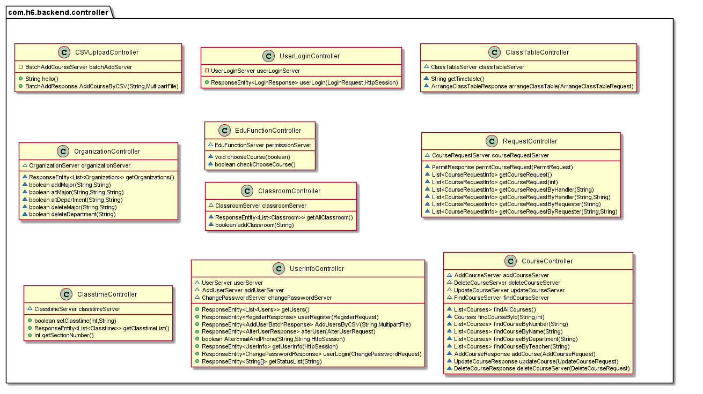

# 实验报告

### 一 、小组分工

#### 前端

孙姝然：3.1.2,3.1.3,用户修改个人信息

张涵星：3.1.1大部分内容

#### 后端

王耕宇：3.1.1所有要求，课程时间和教室部分内容，部署服务器并实现了后端、数据库持久化，后期代码的维护和项目的测试驱动工作。

吴小芥：3.1.2和3.1.3的所有要求，包括课程的增删改查，管理员批准功能，教务管理，文件上传，以及部分接口和文档工作。

### 二、实验设计

#### 类的设计

**Entity:**

Permission类：选课权限（或其他公共权限）的开关
Classtime类：每节课的时间
User类：用户的注册信息
Classroom类：读取现存教室的列表，目前设只读
RequestEntity类：存储用户请求（如增加课程），供管理员批准
Courses类：课程注册信息
Organization类：控制学院和专业，用于教务管理

**Service:**

admin包：处理管理员专有业务，包括批量添加课程、开关公共权限、排课表、处理用户请求（课程相关）
OrganizationServer：增减学院和专业，现有管理员操作
ClassroomServer：读取和添加教室列表
ClasstimeServer：一天14节课，用于调整每节课的时间
course包：处理课程相关的业务，包括查询（支持不同关键字）、修改、注销和添加，普通用户进行增删改会先生成相应请求，供管理员处理
handler包：普通用户的处理请求经管理员批准后，调用相应的handler，在数据库中对相应课程进行操作
user包：处理和用户相关的事宜，包括用户登录、修改密码、管理员添加新用户等

**Controller:**

CSVuploader：与批量CSV相关的操作，此处为批量添加课程
UserLogin：用户登录操作
Classtable：管理员排课操作，可以获取各教室列表（包括空闲教室），以及调整各课程的时间地点（并验证不冲突）
Organization：增删改查学院、专业的操作
EduFunc：开关教务权限（比如选课许可）
Classroom：读取和添加教室列表
Request：对用户提交请求的核准和查询操作
Classtime：调整每节课的时间
User：对用户的增删改查、包括批量导入
CourseController：对课程的增删改查、多关键字检索

#### 代码风格说明

##### 后端：

类命名使用大驼峰命名法，方法名和变量名使用小驼峰命名法;` `
Controller的格式为：模块/权限/功能，如：/classroom/admin/addclassroom/{classroom}，模块是一个controller的总路径，权限部分有利于拦截访问权限；

##### 前端：

组件名大驼峰，变量小驼峰，函数名下划线，路径名全小写

#### 测试用例

具体测试用例和测试文档在华为云[测试用例](https://devcloud.cn-north-4.huaweicloud.com/cloudtest/project/986ecf8929224e029c00ae0fc8bbb529/testdesign/5f18aa04a1ac4ceb976af70924a81238)中

| *用例名称    | 用例编号 | 处理者             | 用例状态 | 用例结果 | 用例级别 | 测试步骤1                                                    | 预期结果1                                                                      | 测试步骤2                                                                                                | 预期结果2                                    | 测试步骤3                                                                                    | 预期结果3                                                  | 测试步骤4                                                                             | 预期结果4              | 测试步骤5                                                                                                                    | 预期结果5    | 测试步骤6                                                                                                                                                                                                                | 预期结果6        | 测试步骤7                                                                      | 预期结果7          | 测试步骤8                                                  | 预期结果8          | 测试步骤9                                  | 预期结果9 |
| ------------ | -------- | ------------------ | -------- | -------- | -------- | ------------------------------------------------------------ | ------------------------------------------------------------------------------ | -------------------------------------------------------------------------------------------------------- | -------------------------------------------- | -------------------------------------------------------------------------------------------- | ---------------------------------------------------------- | ------------------------------------------------------------------------------------- | ---------------------- | ---------------------------------------------------------------------------------------------------------------------------- | ------------ | ------------------------------------------------------------------------------------------------------------------------------------------------------------------------------------------------------------------------ | ---------------- | ------------------------------------------------------------------------------ | ------------------ | ---------------------------------------------------------- | ------------------ | ------------------------------------------ | --------- |
| 选课管理     | 106      |                    | 完成     | 成功     | Level 2  | 管理员进入权限管理下拉框的选课管理，对选课按钮进行开关       | 选课按钮关时，学生页面不显示课程信息并提示，选课按钮开时，学生页面显示选课信息 |                                                                                                          |                                              |                                                                                              |                                                            |                                                                                       |                        |                                                                                                                              |              |                                                                                                                                                                                                                          |                  |                                                                                |                    |                                                            |                    |                                            |           |
| 教务管理     | 105      |                    | 完成     | 成功     | Level 2  | 管理员进入侧边栏教务列表，进行节次、时间、教室的修改         | 成功修改                                                                       | 管理员对课程进行排课                                                                                     | 成功排课并显示                               |                                                                                              |                                                            |                                                                                       |                        |                                                                                                                              |              |                                                                                                                                                                                                                          |                  |                                                                                |                    |                                                            |                    |                                            |           |
| 课程信息管理 | 104      |                    | 完成     | 成功     | Level 2  | 使用管理员界面，进入侧边栏课程页面                           | 进入课程页面                                                                   | 使用教师账号进行登录，进入侧边栏课程页表页面                                                             | 进入课程列表页面，显示课程                   | 使用管理员进行登录，进入侧边栏课程页面，点击添加单条课程，输入合法信息进行添加               | 课程添加成功                                               | 使用管理员进行登录，进入侧边栏课程页面，点击“批次添加课程”，输入合法csv文件进行添加 | 课程信息添加成功       | 使用管理员进行登录，进入侧边栏课程页面，点击课程编辑，对课程进行修改                                                         | 修改成功     | 使用管理员进行登录，进入侧边栏课程页面，点击删除按钮删除课程                                                                                                                                                             | 课程删除成功     | 使用教师账号进行登录，进入侧边栏课程列表页面，对自己所属课程进行修改、删除申请 | 管理员页面显示请求 | 使用教师账号进行登录，进入侧边栏课程列表页面，添加课程申请 | 管理员页面显示请求 | 管理员在侧边栏课程的课程申请列表中处理申请 | 成功处理  |
| 院系信息管理 | 103      |                    | 完成     | 成功     | Level 2  | 使用管理员登录账户，点击侧边栏学院专业，进入学院专业列表界面 | 获取学院、专业信息                                                             | 使用管理员登录账户，点击侧边栏学院专业，进入学院专业列表界面，执行删除专业操作                           | 成功删除专业，但不删除院系                   | 使用管理员登录账户，点击侧边栏学院专业，进入学院专业列表界面，进行删除院系操作               | 成功删除院系及其所属专业                                   | 使用管理员登录账户，点击侧边栏学院专业，进入学院专业列表界面，进行增加院系操作        | 成功添加               |                                                                                                                              |              |                                                                                                                                                                                                                          |                  |                                                                                |                    |                                                            |                    |                                            |           |
| 用户信息管理 | 102      |                    | 完成     | 成功     | Level 2  | 使用管理员登录账户，进入首页，点击侧边栏用户，下拉框用户列表 | 获取全部用户信息，并可对用户信息进行修改                                       | 使用管理员登录账户，进入首页，点击侧边栏用户，下拉框用户列表，点击页面中编辑按钮，对用户信息进行合法编辑 | 用户信息合法编辑成功，用户状态可以修改成功   | 使用非管理员账号登录账户，进入首页，点击右上角下拉框中“账户信息”，对手机号和邮箱号进行修改 | 可以看到用户个人的用户信息，并能够对手机号和邮箱进行修改。 | 使用合法非管理员账号登录账户，点击右上角下拉框中用户信息，点击修改密码进行密码修改    | 用户可以成功修改密码   | 使用管理员账号进行登录，进入侧边栏用户，下拉框用户列表，点击子页面内右上角，点击下拉框“单次添加”，输入合法用户信息添加用户 | 成功添加用户 | 使用管理员账号进行登录，进入侧边栏用户，下拉框用户列表，点击子页面内右上角，点击下拉框“批量添加”，输入合法csv文件添加用户。csv文件遵循Role，User_id，Username，Id_number，Phone_number，Email，Department，Major的格式 | 成功批量添加用户 |                                                                                |                    |                                                            |                    |                                            |           |
| 用户登录测试 | 101      | 王耕宇-17307110209 | 完成     | 成功     | Level 1  | 通过浏览器输入localhost:8080，使用合法账号，错误密码非法登录 | 页面显示登录窗口，输入后不会进行跳转                                           | 通过浏览器输入localhost:8080，使用管理员账号合法登录                                                     | 页面显示登录窗口，输入后跳转到管理员管理页面 | 通过浏览器输入localhost:8080，使用普通（老师，学生）账号合法登录                             | 页面显示登录窗口，输入后跳转到老师或学生相应界面           | 通过浏览器输入localhost:8080，使用非reading/working状态的账号进行登录                 | 登录失败，页面不回跳转 |                                                                                                                              |              |                                                                                                                                                                                                                          |                  |                                                                                |                    |                                                            |                    |                                            |           |

### 三、 问题及解决方案

1. 课表的多层嵌套列表转换json出错：写一个封装类存储三层列表的所有数据，并从最小单元（某教室某天某节）开始自定义维护json字符串，返回给前端是一个String；` `
2. 不同组员的环境不同，库对象（Pair）不能用：对于有争议的对象，采用自己写的类，以免不通用；` `
3. 存储用户请求：由于普通用户增删改课程要递交请求给管理员，所以将用户的request实体暂时存在数据库，由于request实体有很多种，故将其统一转换为json字符串存储，为每个用户请求定义handler，当管理员审批通过时，调用handler并解析数据库中的json，执行请求者的操作；` `
4. 节次时间设置和教室设置：单独在数据库设立表，节次时间冲突在前端输入被限制
5. 多表数据关联问题：在方法中对多张表进行操作，后续操作将会设置主表

### 四、 代码检查结果

#### 前端

#### 后端

### 五、缺陷管理

#### 严重级

描述：出现bug导致程序中途崩溃或不能运行（比如指针错误）；` `
处理：这类问题会耽误全组进度，负责的同学应该立即进行处置，包括修改bug或给出临时解决办法，确保项目其他部分正常运行；若该bug具有典型性，应该把处理过程记录在小组语雀上；

#### 重要级

描述：出现bug导致程序虽能运行起来，但不能照常返回（比如json为空），或返回值完全错误，功能基本不能实现；` `
处理：这类问题会拖延部分进度，有时可以临时搁置（因为程序能跑），应该由负责同学尽快处理，最好在一天内；若该bug具有典型性，应该把处理过程记录在小组语雀上；

#### 一般级

描述：出现bug使程序能照常返回，但返回值存在错误，功能部分不能实现（比如部分课程的时间地点存在冲突，没有判断出来）；` `
处理：这类问题基本不会拖延进度，如果不能马上解决，可以先记录在语雀上，在数天内解决，但必须清楚告知其他组员哪里存在问题，以免信息不对称；

#### 瑕疵级

描述：出现bug使程序能照常返回正确结果，但存在瑕疵（比如代码冗长低效）或漏洞（比如普通用户可以操作管理员的controller）；` `
处理：这类问题基本不会拖延进度，应在适当时间予以纠正或重构，可以先记录在语雀上，在数天内解决；

#### 接口问题

描述：前后端接口定义有不清或理解有歧义造成的问题；` `
处理：虽然不是bug，但容易影响进度，故应该及时修正接口文档，通告问题，必要时对接口进行重写；
备注：后端大多数问题是接口问题，没有对接口类设置setter和getter，由于目前并不对代码结构和安全性造成影响，基本选择了忽视

### 六、选做项完成情况

#### 测试驱动开发

使用测试驱动开发，具体测试请看[测试文档](https://devcloud.cn-north-4.huaweicloud.com/cloudtest/project/986ecf8929224e029c00ae0fc8bbb529/testdesign/5f18aa04a1ac4ceb976af70924a81238)。

#### 项目部署

项目部署在121.36.205.112，实现了数据库（端口：3306）和后端SpringBoot框架代码（端口：8000）的持久化。

### 七、Tag截图

### 八、心得体会

- 王耕宇：这次lab积累了一些经验，比如[接口](https://console-docs.apipost.cn/preview/c14c6b9973a85467/cc2c0eb3dfa818f4)先行，服务器部署等；同时暴露出了很多问题，比如小组成员之间沟通不顺畅，成员之间进度无法对接导致相互掣肘的问题等。以及进度监督不成功，到时赶ddl问题产生，影响了项目本身的优化。希望在lab3之后大家能发挥更加积极的能动性。
- 张涵星：有时候效率是逼出来的。平时对自己狠一点最后就不会着急，需要改善个人习惯。而且有不少代码技术债：就是自己在设计学院专业和用户列表时，为了复用考虑，选择公用一个自定义vue组件，结果为考虑两者差异性，导致复用越来越难，设计越来越复杂，到最后放弃原来的设计，改为最差的实现方式。另外，孙姝然同学再次让我惊讶，她的设计水平，对vue组件的复用都比我优秀，希望之后能够多交流，否则在lab4我可能还停留在她的lab3的代码的水平。
- 孙姝然：前端的问题：我觉得最严重的的应该是路由，这是因为前后端采用了不同的方案造成的。接下来是一些条件渲染的问题，主要就是我没做自动更新和清除、会保留旧值，这个是我还没有检查过每个页面就匆忙push以及考虑不周的结果。现在权限有耦合需要分离、小表单不分配路径使用dialog。我感觉我的复用没什么问题，传的参数不多。接口调用需求没有对接好，影响前端开发效率。后期加功能比较匆忙，欠下了技术债。还有就是我可能合作的时候有点暴躁，有时候说话多做事少。我有时考虑直接问负责同学可以更简单获得答案，但同学也不可能一直秒回，多看看代码也是可以接受的。对于要求的分析要准确，如果负责实现功能的同学在设计时有犹豫可以一起讨论，代码的修改应该由最初实现功能的同学完成，同时每个人在交接的部分应尽量说明变量的含义，设计的思路。
- 吴小芥：这次lab的工作量较大，时间上安排有点紧；在接口的定义方面前后端存在歧义，且我忘了及时更新接口文档；此外，初期对教务管理的理解存在偏差，导致后期临时修改，较为匆忙；往后应合理安排进度，增加组员间的沟通，在写代码前明确需求定义。收获是增加了写增删改查的熟练度，并且对CSV，json，上传文件有了更多了解。
