# 6H-lab4实验报告
- 负责选课、筛选、退课等后端接口
- 编写自动化接口测试用例
- 实现后端华为云自动化编译、部署
- 前端学生选课界面（可选、已选、已修、课表）
- 前端部署
- 系统测试
-课程增加新信息：上课学期、课程类型、可选专业、教室容量
-学期、选课阶段管理
-管理员、开课教师、选课学生查看课程信息
-学生选课申请与管理员审核
-管理员条件搜索

##2、实验设计
### 后端整体结构
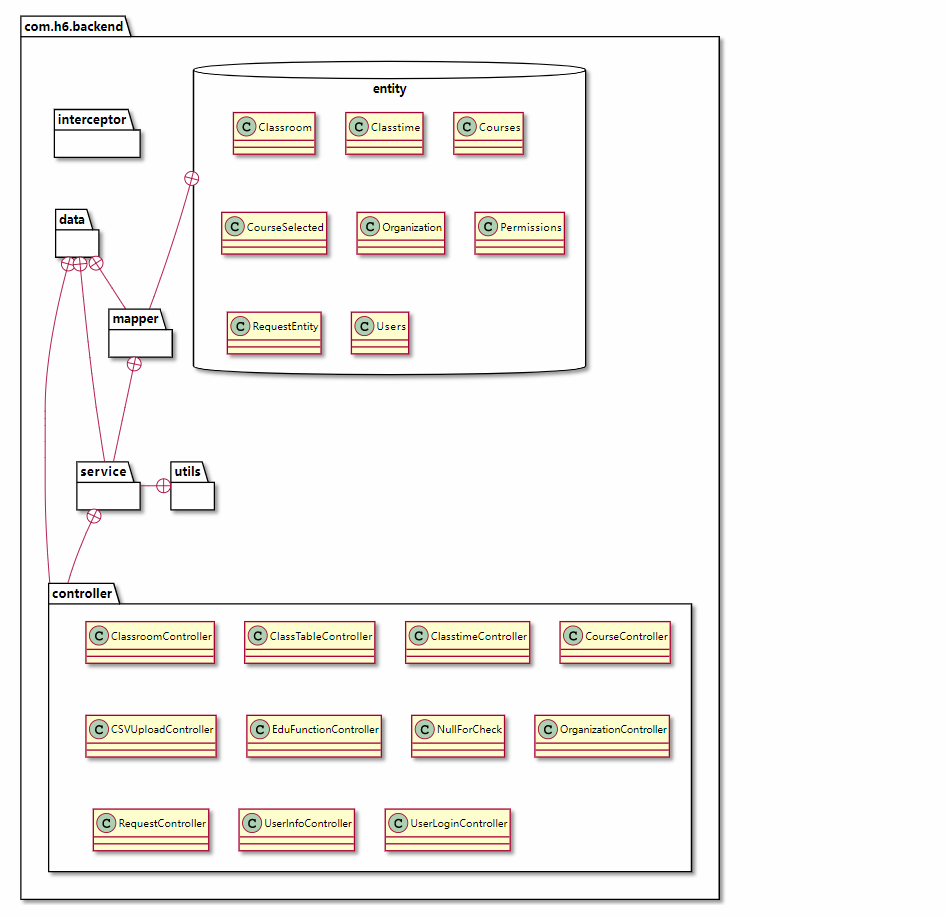

后端整体结构如上图所示，其中`entity`包中的类信息同时代表数据库表信息。

结构整体上较为清晰，`controller`中接口接受响应后，调用`service`包中相应的类，相应类通过`mapper`包中数据库的映射进行数据库信息的增删改查。

其中`data`包中为普通的接口类， `utils`包中为必要的工具类，`interceptor`包中为必要的拦截器类。

`interceptor`包中类是面向切面设计，这里不再用类图展示包关联。

由于相应的关联类名称前缀基本相同，并且具有明显的包关联结构，所以这里使用包关联展示大致信息。
### service类设计
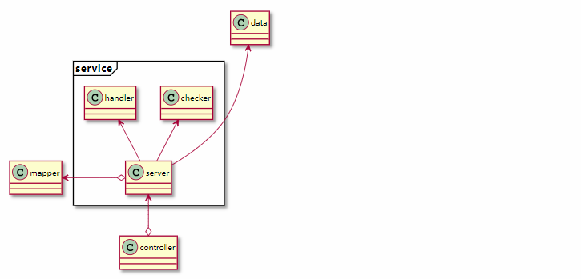

如图所示，具体`service`操作通过相应的`server`类参与到`Spring`框架的`IOC`中。

同时`server`类通过在相应的方法中包含`checker`和`handler`的类信息，通过中实例化调用或调用静态方法，分别实现了接口数据合法性检查和数据增删改时数据库信息的依赖检测。

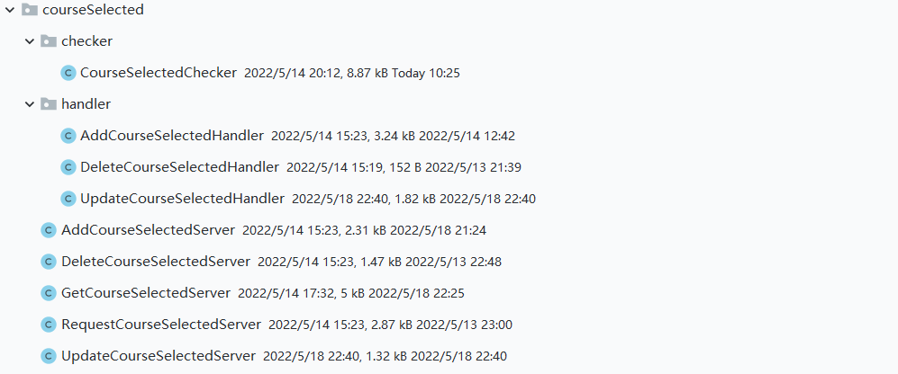
这一设计方式极大减少了检查工作造成的代码重复现象。具体结构如图例所示。

### mapper类设计
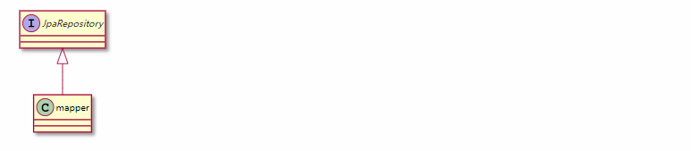
如图所示，`mapper`类通过继承`JPA`接口实现相应的数据库操作

### interceptor类设计
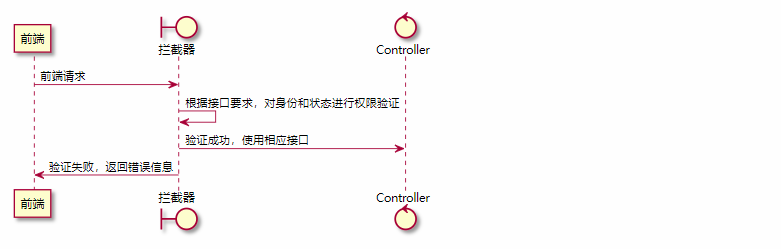

这里通过时序图来阐明`interceptor`类的设计，拦截器依托于session机制和小组url接口的设计协议来进行前端请求的权限验证。 能够有效确保登录验证和身份权限验证

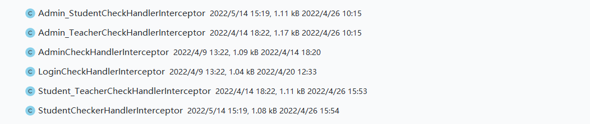
相应类信息如图所示，前缀表明要求的身份信息或者登录状态。

## 2、问题及解决方案
#### 1，多重条件下的相同数据请求
处理人：王耕宇
在获取选课信息的情况中，由于前端根据课程Id、学生id、选课状态、老师id等不同的条件获取选课接口，条件比较杂乱。
解决方案： 对请求接口进行处理，允许在不使用相应的查询条件时其值为空。这是通过mysql语句判空来作为依托的，涉及了比较高的mysql知识。
#### 2，前端要求的返回数据不在同一表内
处理人：王耕宇
在有些情况下，前端要求获取选课信息及关联的教师名字，由于JPA的接受类限制，这一情况也是一个较难实现的问题。
解决方案：在使用mysql的子查询、多表查询功能基础上，使用字符串流接受数据后再映射到相关类中。
#### 3，如何实现自动化部署
处理人：王耕宇
在lab4阶段对自动化部署进行了实践，自动化部署极大地方便了部署操作，且能及时地将bug修复并重新部署
解决方法：使用华为云的流水线进行部署，先编译打包，再推送到服务器启动SpringBoot。设置流水线触发条件为代码提交或者打标签时，美滋滋。
## 3、代码检查结果
#### 前端
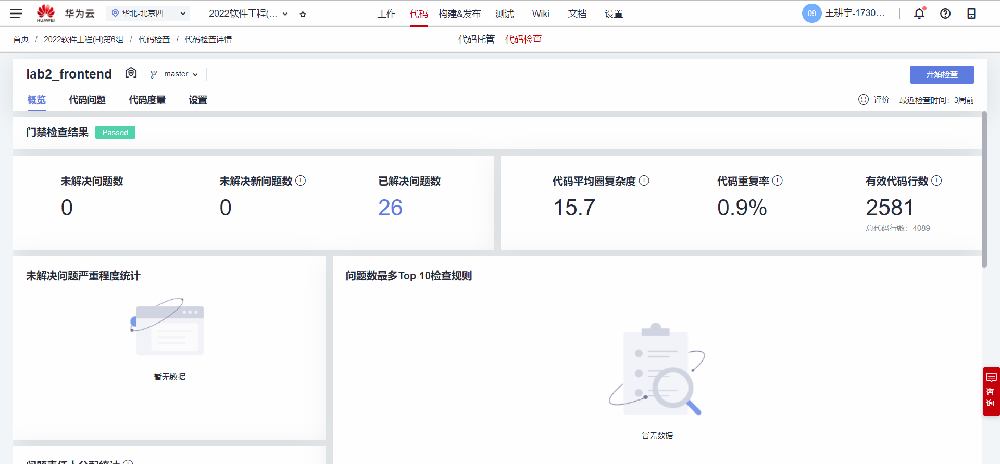
#### 后端
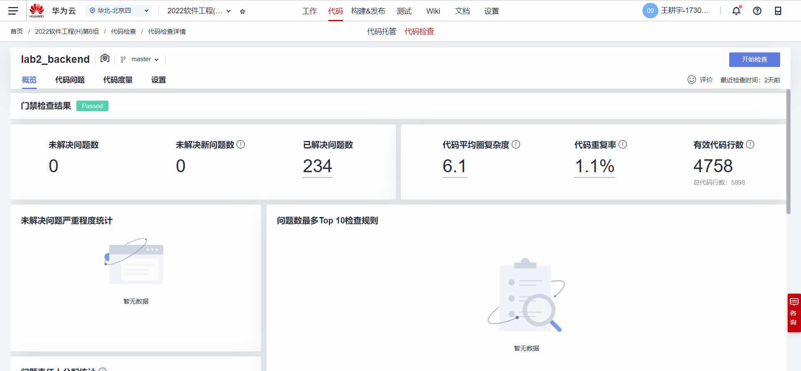

## 4、软件测试
### 单元测试
使用JUnit进行单元测试，测试截图如下：
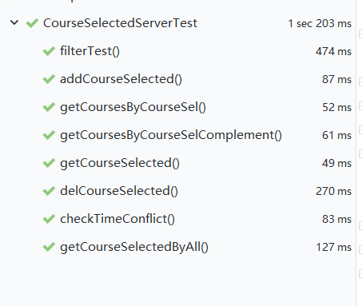
### 接口自动化测试
#### 开课
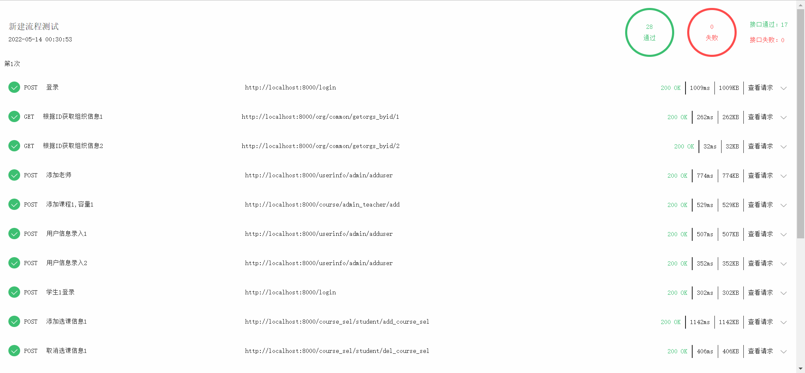
#### 选课申请、扩容、退课
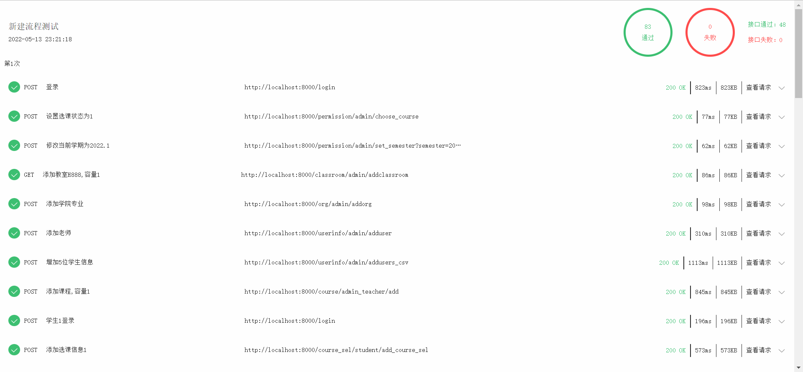
### 系统测试
每个测试计划执行历史如下，至最新一次历史执行所有测试步骤完成通过。

## 5、缺陷管理
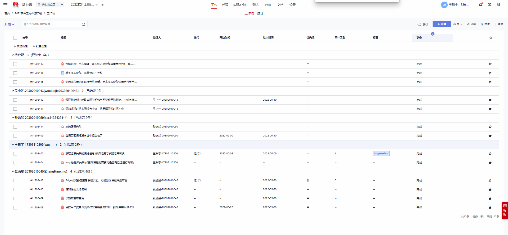

## 6、Tag截图
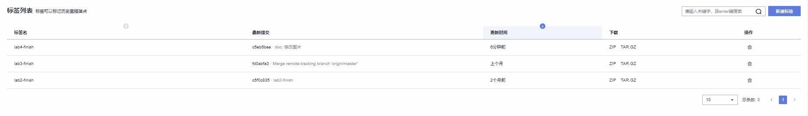
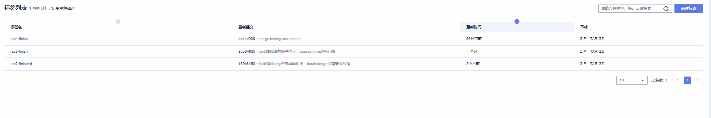
## 7、心得体会
总体感觉还好，在筛选的过程中涉及到了一些高阶mysql知识，在设计后端项目自动化部署的过程中遇到了一些困难，在写接口自动化测试用例的时候也是慢慢摸索得出了写的经验，包括JUnit也是要慢慢摸索的过程中进行了了解，总体感觉这次压力比较小。
主要问题还是出在前后端协同和进度上，大家制定的进度往往无法按时完成，最后还是演化成了赶ddl。在结构设计和任务分配上出现了一些前后端的责任空缺，感觉这样很不好，大家应该尽量弥补重叠，而不是暴露空缺没人管。
另外就是测试问题，有些测试在一开始是好的，但是在后边人的修改过程中又成了错误的，这给测试造成了很大的麻烦。
